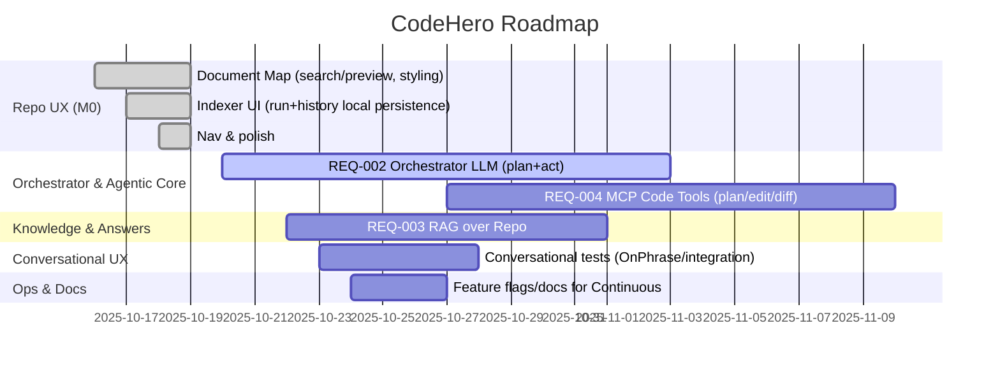

# Roadmap

High-level plan for requirements with timeline. Dates are indicative.

Notes
- Repo UX M0 completed (Document Map, Indexer UI, nav polish).
- Next focus: Orchestrator LLM core and RAG bootstrap in parallel.
- Dates will adjust as velocity data emerges.
